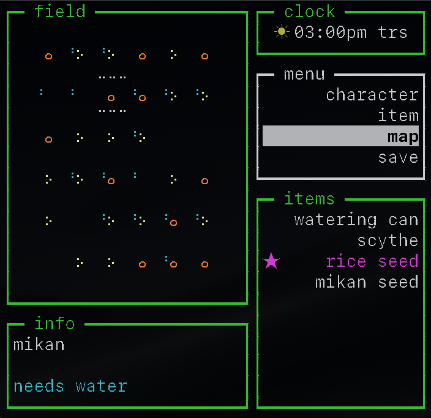

### Some things you can do with plants:
* grow
* discover
* breed
* sell
* cook
* study
* brew
* distill
* trade
* eat

It is my hope that in this game you will be able to do all of those things, and more!

### Testing:

If you would like to help playtest the game:
1. Clone or download this repo.
2. In the root directory, run:
    ```bash
    npm install
    node game.js
    ```
3. Raise an issue here or email me directly: tresscd@gmail.com

### Phase I:


This phase is focusing on the core game engine, and developing a way of modeling the various systems and relationships found on a simple farm.



I have chosen a command line UI for this phase in order to speed up prototyping. The goal is to uncouple the rendering & UI logic from the game logic as much as possible. This makes it easier to iterate and collaborate. It will also hopefully aid in the transition to a modern framework such as Unity, when that time comes.

### Observable:

The game engine is primarily built using the observer pattern, loosely modeled off of **Redux**. A singleton, called the **store** for now, acts as a kind of global state for the entire game.

Most game objects have a reference to the store, and can fire events on it. Objects can also subscribe to events, in order to perform any number of tasks when such an event is fired.

The eliminates coupling between most game objects, and makes the code more modular and readable.

```javascript
class Observable {
    constructor() {
        this._events = {};
    }

    addEvent(name, cb) {
        if (!this._events[name]) {
            this._events[name] = new Set();
        }

        this._events[name].add(cb);
    }

    removeEvent(name, cb) {
        if (!this._events[name]) return;

        this._events[name].delete(cb);
    }

    fire(name, ...args) {
        if (!this._events[name]) return;

        this._events[name].forEach(cb => {
            cb(...args);
        })
    }
}


class Store extends Observable {
    constructor() {
        super();
        // example initial state. later this json will live elsewhere.
        this.state = {
            activeComponent: 'field',
            weather: 'frost',
            time: {
                timeName: '06:00AM',
                dayName: 'SUN'
            }
        };

        this.addEvent('changeFocus', componentName => {
            this.setState({
                activeComponent: componentName,
                justChanged: true
            });
            // this is a temporary workaround for an event propogation issue
            // should ultimately be addressed with a queue or similar
            setTimeout(() => {
                this.setState({justChanged: false})
            }, 0)
        })
    }

    setState(newState) {
        this.state = Object.assign({}, this.state, newState);
    }
}
```

While this ideal for one-to-many relationships, one-to-one relationships (i.e. for instance such as between a tile of dirt and its resident plant) can often circumvent the store altogether and talk directly to each other.

Down the road it may make sense to divide the store in two, making one half responsible for event management and the other responsible for global state.